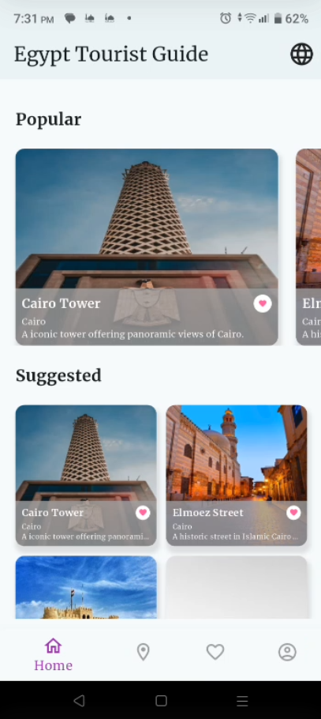
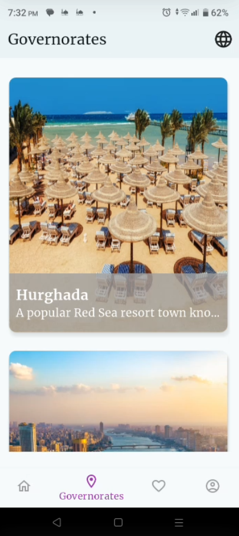
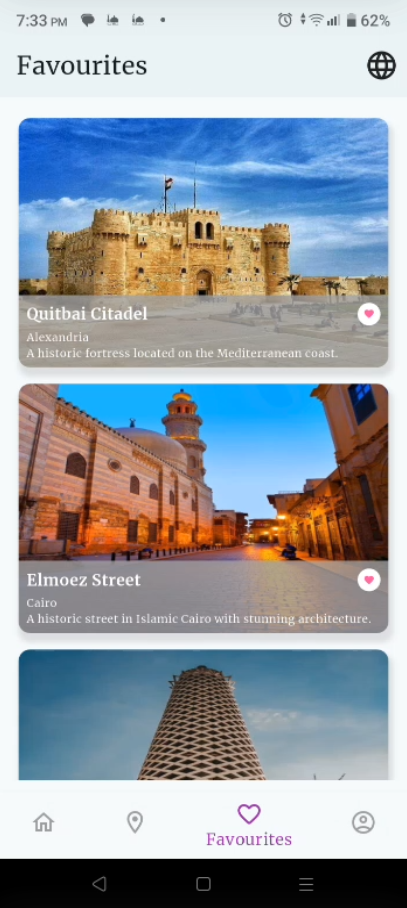
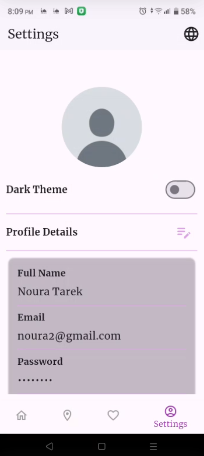
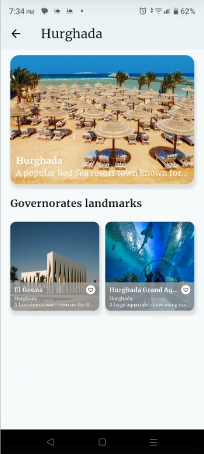
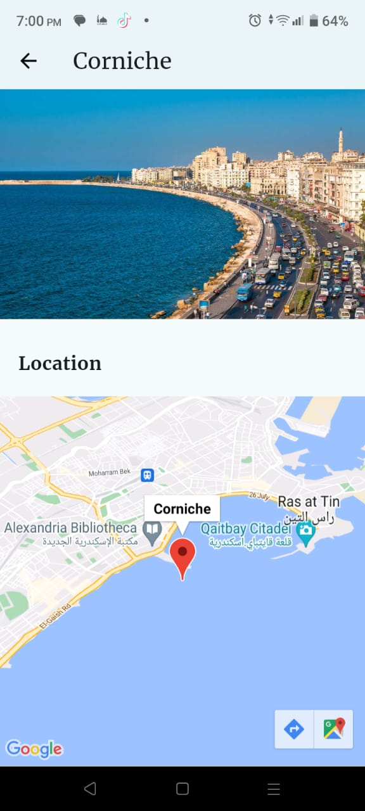
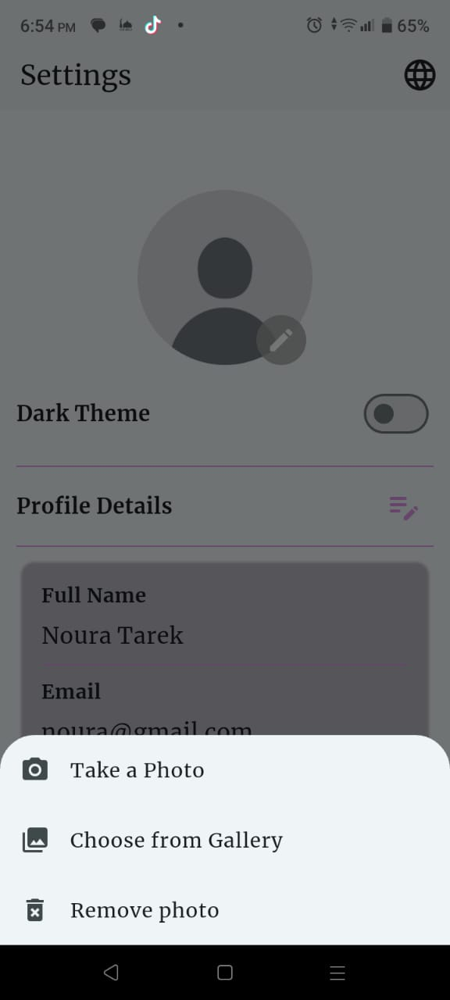
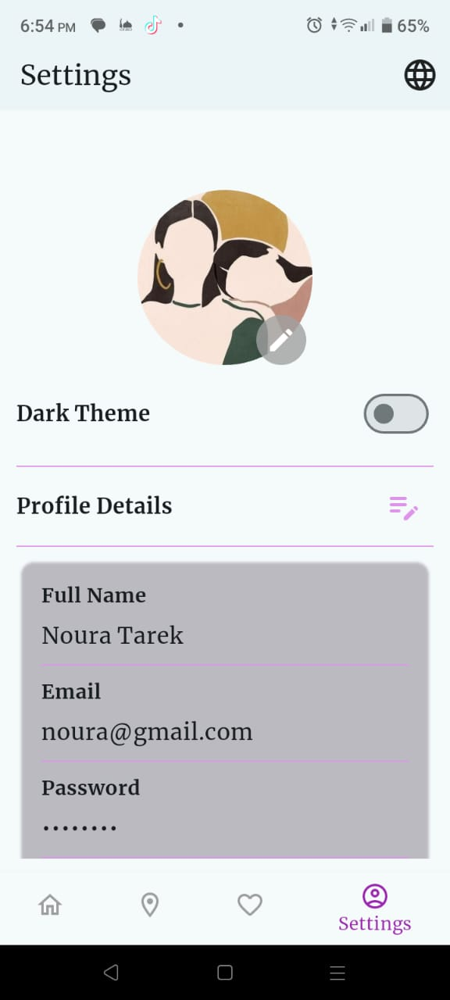
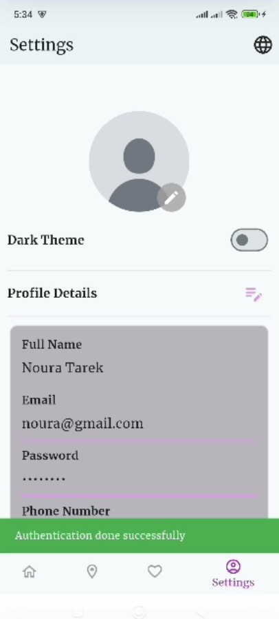
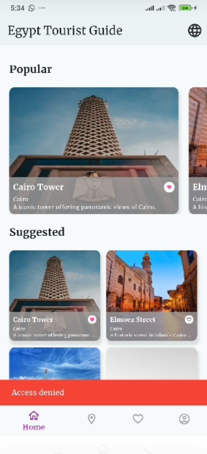

# Egypt Tourist Guide - Mobile Application

## Project General Description

The **Egypt Tourist Guide** is a mobile application designed to help tourists explore landmarks, museums, and attractions across various Egyptian governorates. The app provides a user-friendly interface for discovering popular places, saving favorites, and managing user profiles. This project aims to enhance the tourism experience by offering curated suggestions and personalization.

# State Management
The app contains four Blocs:

1- **User Authentication**:
- AuthBloc.
- ProfileBloc.

2- **Settings**:
- ThemeBloc.

3- **Home screen & places**:
- PlacesBloc.

-------------------

# Connected to Firebase
Project configuration with firebase --> done using the flutterfire CLI and flutterfire configure command.

After the project is configured, firebase options file is added to lib folder.                                                         
Then, we add firebase core, firebase_auth, cloud_firestore packages to the pubspec.yaml file.

And initialize firebase in main.dart file.

-------------------

# Pages & Features

### 1. Signup Page
- **Input Fields**: Full Name, Email, Password, confirm password, Phone Number (optional).
- **Data Handling**: Input data is saved in variables.
- **Navigation**: Includes a **Signup** button that directs users to the **Login Page**.

### 2. Login Page
- **Input Fields**: Email and Password.
- **Validation**: Checks credentials against saved data.
- **Navigation**: Successful login redirects users to the **Home Page**.

### 3. Home Page
- **Suggested Places to Visit**: Displays attractions in a grid view.
- **Popular Places Section**: Displays horizontally scrollable cards for popular attractions.
    - Each card includes:
        - Image of the place.
        - Name of the place.
        - Governorate name.
        - The place's description.
        - A favorite icon (toggle on/off).

### 4. Governorates Page
- Displays a list of governorates.
- **Navigation**: Selecting a governorate navigates to a page showing landmarks specific to that governorate.

### 5. Profile Page
- Displays user details including:
    - Full Name
    - Email
    - Address
    - Phone number
    - Password (hashed for security).

### 6. Favorites Page
- Displays a list of favorite places.
- Static cards similar to the **Popular Places** section.

### 7. Bottom Navigation Bar
- Visible on main pages: **Home**, **Governorates**, **Favorites**, **Profile**.
- Includes icons for easy navigation:
    - Home
    - Governorates
    - Favorites
    - Profile

### 8. Page Navigation Animations
- Smooth animations for transitions between pages.
- SlideRightRoute
- FadeTransitionRoute

### 9. Localization
- Apply localization feature (Ar and En) to adapt the app to different languages and regions.
- Using easy localization package.

### 10. Theme feature
- Allow manually toggle between light and dark modes.
- Using theme bloc.

### 11. Google Maps Integration for Landmarks
- Enhance the Government Page by including Google Maps functionality for each landmark.
- Display a Google Map widget in each landmark's details page with a marker indicating the landmark's location.
- When the map is clicked, the user is redirected to Google Maps with the landmark's longitude and latitude to start navigation.

### 12. Profile image Management
- Apply changing profile image feature.
- The user can change his image from Gallery or Camera.
- Also, delete profile image option provided.

### 13. Authentication using fingerprint auth
- The user cannot access his profile before scanning his fingerprint for security.
- If the user device does not support biometric authentication, it will be redirected to the profile
  page (assuming that the user is authenticated).
- Auth done using local auth package.

## Permissions Used:
In AndroidManifest.xml file:
- android.permission.USE_BIOMETRIC.
- android.permission.USE_FINGERPRINT.
- android.permission.INTERNET.
- android.permission.CAMERA
- android.permission.WRITE_EXTERNAL_STORAGE -> to save image file locally.

## Navigation Flow
1. **Login Page** → **Signup Page** → **Login Page** → **Home Page**
2. **Home Page** → **Governorates Page** → **Landmarks Page** → **Landmarks details**
3. **Home Page** → **Favorites Page**
4. **Home Page** → **Settings Page**

------------
## App Structure
The code is organized using **MVC Architecture** for clean and maintainable code structure.                   
The main folders in lib are:
- **controllers**: contains controllers which deal with presentaion layer to handle logic (auth bloc, places bloc, profile bloc, and theme bloc).
- **core**: define lang and services logic folders includes firebase service. also, the other general files in the app (lang folder, services folder).
- **models**: define the data models (place model, governorate model, user model, and screen model).
- **views**: UI design and components (screens and widgets).

--------
## How to Run the App

1. Clone the repository.
2. Run `flutter pub get` to install dependencies.
3. Run `flutter run` to start the app.

----------------
## Screenshots

| Home Page                               | Governorates Page                                 | Favourites Page                      |
|-----------------------------------------|---------------------------------------------------|--------------------------------------|
|                 |           |  |

| Settings Page                           | Governorates Places                               | Home Page (dark and arabic)          |
| ----------------------------------      | ------------------------------------------------- | -------------------------------      |
|         |    |         |

| Google maps (place details)             | Change profile options                            | Change profile Output                |
| ----------------------------------------| --------------------------------------------------| -------------------------------------|
|          |            |         |

| Auth fingerprint                        | Auth done                                         | Auth failed                          |
| --------------------------------------- | --------------------------------------------------| -------------------------------------|
|    |                        |       |

-------------------------

## **Packages Used**
- **SharedPreferences**: For local data storage and offline support ==> https://pub.dev/packages/shared_preferences.
- **easy_localization**: For localization feature ==> https://pub.dev/packages/easy_localization.
- **flutter_bloc**: For state management using bloc ==> https://pub.dev/packages/flutter_bloc.
- **firebase_core**:  For using the Firebase Core API ==> https://pub.dev/packages/firebase_core.
- **firebase_auth**: For using Firebase Auth and enabling authentication using email and password. ==> https://pub.dev/packages/firebase_auth.
- **cloud_firestore**: for Cloud Firestore, a cloud-hosted, noSQL database with live synchronization and offline support. ==> https://pub.dev/packages/cloud_firestore.
- **skeletonizer**: For skeleton loading effect and enhance user experience during web or app loading. ==> https://pub.dev/packages/skeletonizer.
- **google_maps_flutter**: For using google maps ==> https://pub.dev/packages/google_maps_flutter.
- **url_launcher**: For launching google maps outside the app with specific location ==> https://pub.dev/packages/url_launcher.
- **image_picker**: To enable the user to change his picture by picking images from the image library, or taking pictures with the camera ==> https://pub.dev/packages/image_picker.
- **path_provider**: To get the file download path from the user phone and save image file locally  ==> https://pub.dev/packages/path_provider.
- **local_auth**: To allow local authentication via fingerprint  => https://pub.dev/packages/local_auth
